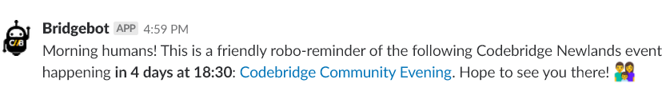

# 🤖 Bridgebot

  

This repository contains the code run by the [Heroku Scheduler](https://devcenter.heroku.com/articles/scheduler) every morning at 10:00 AM UCT+2. 

The script pulls all events listed on the [Codebridge Newlands Meetup.com account](https://www.meetup.com/Codebridge/) via the a [Meetup specific API](http://api.meetup.com/Codebridge/events). Once retrieved it determines whether there are any upcoming events for the following day, and creates a reminder message on the #codebridge-newlands channel on ZA Tech.

For security reasons the URL endpoint of the integration is not stored in the repository, but as an `.ENV` variable on [Heroku](https://dashboard.heroku.com/).